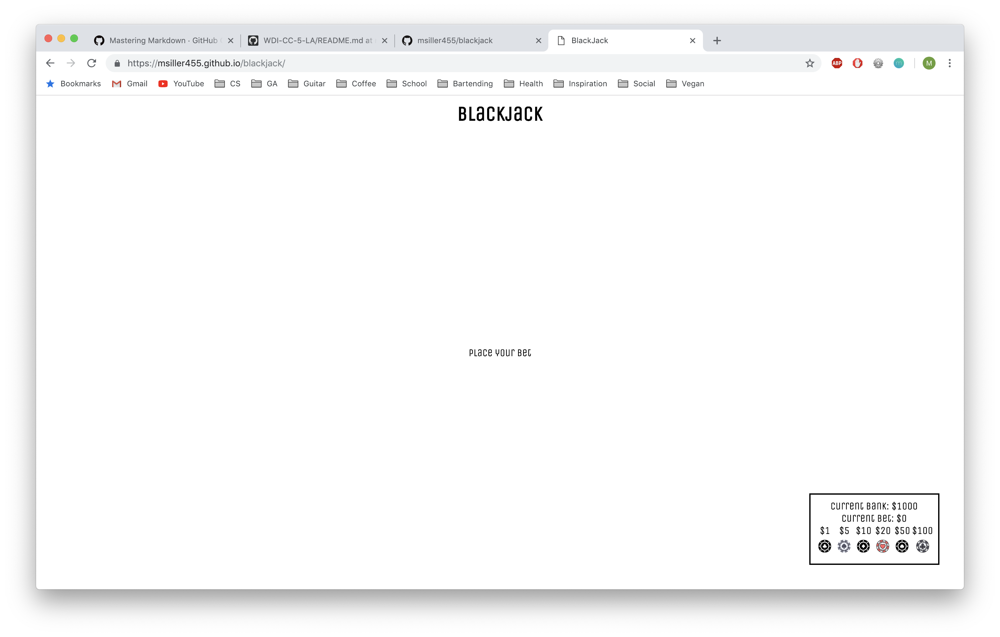
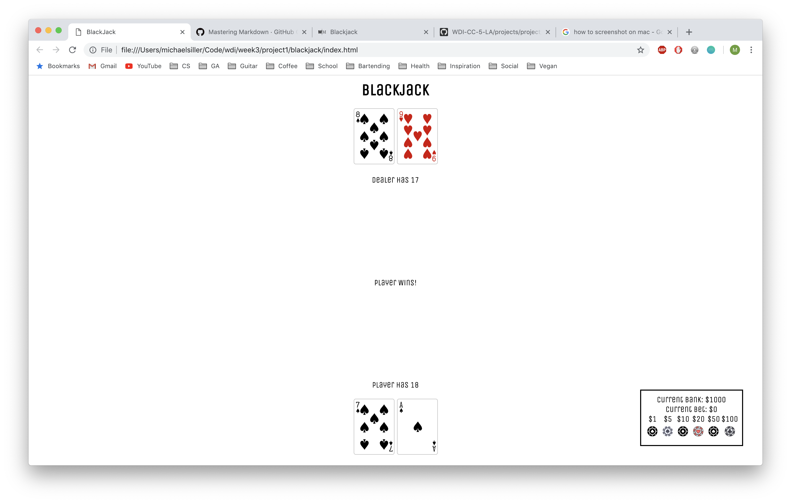

# Blackjack

This is a program recreating the classic card game, Blackjack. The player is able to place bets, draw cards and play against the dealer. Once the player is out of money, they are able to start a new game.

## Deployment Link

https://msiller455.github.io/blackjack/

## Instructions

The game begins with the player placing bets using chip buttons in their bank. Once the bets are placed, two cards are drawn, with one of the dealers cards being shown facedown. The player can decide to hit or stay. By selcting hit, the player will receive an additional card, the goal being to keep the score of their overall hand under 21. Once they are satisfied with their hand, they can choose to stay. The dealer will draw additional cards until either their score reaches 17, or they bust (their score goes over 21).

## Technologies Used

This program utilizes the following technologies to structure and style the webpage, as well as implement the game logic:
* HTML
* CSS
    * Card Starter CSS courtesy of General Assembly
* Javascript
* Jquery

## Screenshots

## Additional Info

Given more time, I would have liked to implement some more advanced game rules in Blackjack, in order to recreate the traditional game as accurately as possible. This would include rules such as split hands and doubling down. 